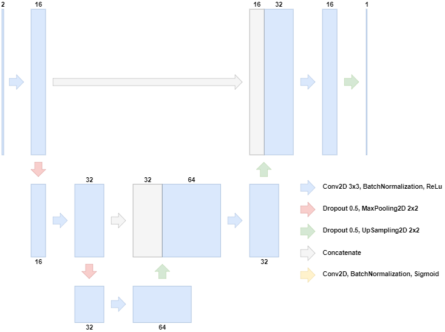

# Deep Learning Based Focus Interpolation for Whole Slide Images

## Model



The model is based on the U-Net architecture and by default consists of two down-sampling and up-sampling blocks.

The model accepts two different z-level images in the input and outputs:
* the intermediate z-level image (target-learning)
* two residual images that represent the difference between the target image and the input images (residual-learning) 

## Data

The model has been tested on the the image set BBBC006v1 from the Broad Bioimage Benchmark Collection [Ljosa et al., Nature Methods, 2012](http://dx.doi.org/10.1038/nmeth.2083).

The dataset is available at: https://bbbc.broadinstitute.org/BBBC006

## Training

1. Download the BBBC006v1 dataset and prepare it according to the following structure:
    ```
    BBBC006_v1
    - train
    -- BBBC006_v1_images_z_00
    -- ...
    -- BBBC006_v1_images_z_33
    --- mcf-z-stacks-03212011_p23_s2_w2d36e0477-6528-4f5c-a76a-d76d199e07ca.tif
    --- ...
    - test
    ...
    ```
    and specify the dataset location in `dfi/bbbc006_v1.py`. Alternatively, implement a new method based on `dfi/bbbc006_v1.py` for a different dataset.

2. Specify the relevant paths in `hparams.yaml`

3. Execute `$./run.sh `
